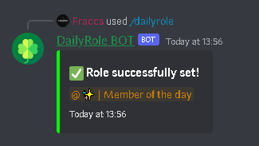
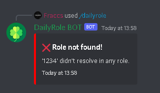

<h1 align="center">DailyRole BOT</h1>

> ## *A Discord BOT that gives a specific role to a random user once a day.*

## 📧 | Invite me!

> https://discord.com/api/oauth2/authorize?client_id=814172130945794128&permissions=8&scope=applications.commands%20bot

## ✔️ | Version

> ### v1.0.0

## 🍀 | Usage

> As simple as it gets, just type the following *slash command*, and the BOT is ready to go!

### ***```/dailyrole <roleID>```***

> Set the role that will be given each day.

Options:

* ```<roleID>``` (string):

    * ```roleID```: The ID of the role.

### *Success message*



### *Failure message*



### *If you don't know how to get your role's ID, just follow these steps:*

1. Open your *server's settings*.

2. Navigate to the role you want to retrieve the ID of.

3. Hover over the role, click on the three dots and hit *'Copy ID'*.
